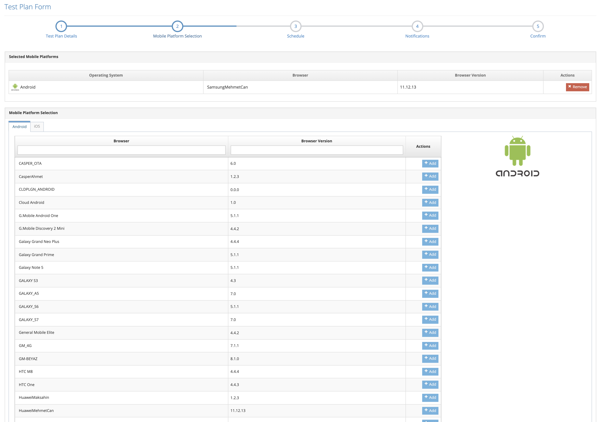
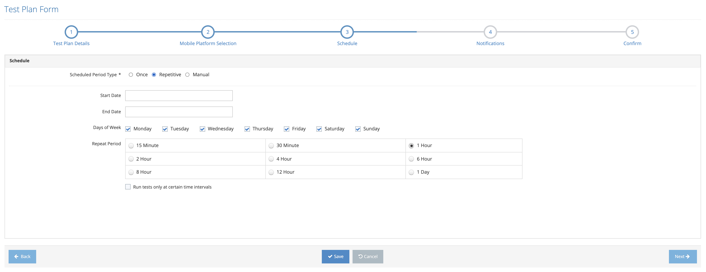
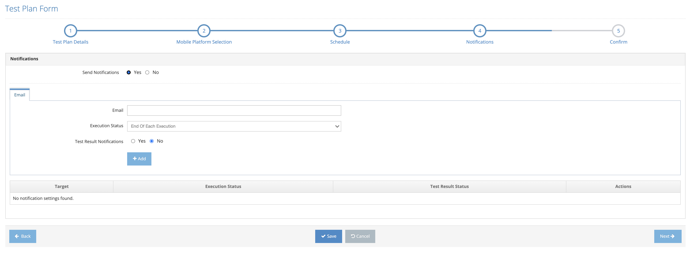
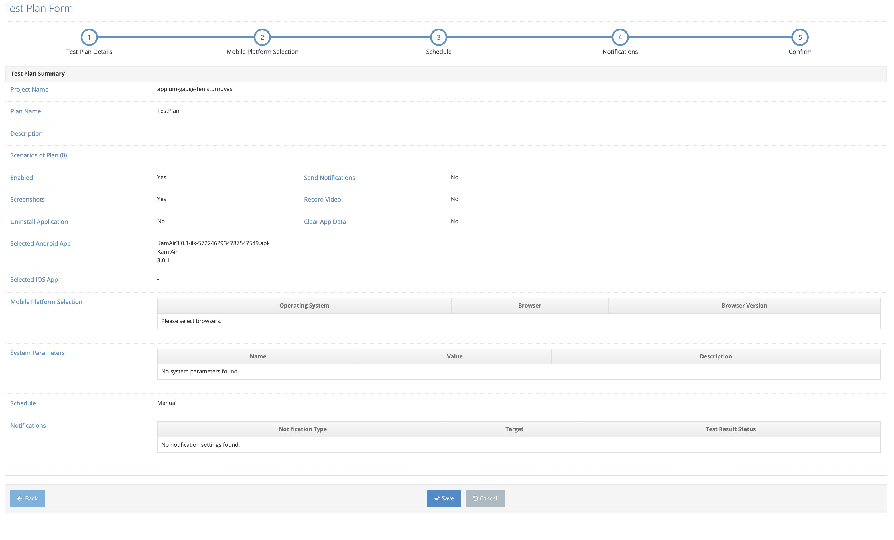

# Create Plan

_**“Create Plan”**_ directs the user to the screen where a new plan definition is made in the system.

The following steps are followed to create a new plan;

1. Select a project from the main Plans screen.


If the Create New Plan button is clicked without selecting the Project Name, the system displays the error message regarding the project name selection.


<figure><figcaption></figcaption></figure>

2. Create the _**Create New Plan**_ button.

<figure><figcaption></figcaption></figure>

3. Enter the fields below in the _**Test Plan Details**_ form;

* Project Name
* Plan Name
* Description
* Scenarios of Plan
* Add Parameters / Java Test Parameters; Clicking the Add Parameters button, the system displays the Java Test Parameters field. The following fields are entered to add parameters.
  * Name
  * Value
  * Description

<figure><figcaption></figcaption></figure>

* Selenium Grid; The environment where the tests will run, Enterprise or Cloud
* Failed Test Retry Count (Number of Repetitions on Test Fail)
* Parallel Test Limit
* Max Execution Time per Scenario
* Enabled
* Screenshots
* Record Video
* Capture Performans Data; Displayed in browser tests, not in mobile tests. Reports values such as screens on time
* Group Test Plan; If one of the two Mobile Devices is the Receiver and the Other is the Sender, the group is defined as the plan and the Receiver/Sender is defined as the parameter in the Plan. (Only in mobile environment tests)
* Clear App Data (Only in mobile environment tests)
* Fetch File From Device; In mobile tests, the directory of the log file is given where the log file is almost. (Only in mobile environment tests)

<figure><figcaption>
Test Plan Details 1
</figcaption></figure>

<figure><figcaption>
Test Plan Details 2
</figcaption></figure>

4. a. Click _**Next**_ to continue to the next form screen.

&#x20;       b. Click the _**Cancel**_ button to cancel the process of adding a new plan.

5. The next step depends on the project type;

* If the selected project is _**a web project (Selenium)**_,  _**Browser Selection**_ screen opens.&#x20;
* If the selected project is _**a mobile project (Appium)**_, _**Mobile Browser Selection**_ screen opens.
* If the selected project is _**a service project**_, the Schedule screen opens, which is the              next step since no platform selection is made.

6. Enter the following fields on the Mobile Platform Selection/ Platform Selection screen;

* Mobile Platform Selection (Browser/Browser Version by clicking the Add button)&#x20;
* Platform Selection (Screen Resolutions/Browser Selection by clicking the Add button)

7. a. Click the _**Next**_ button and go to the Schedule tab.                                                                        b. Click the _**Back**_ button to return Test Plan Details ta&#x62;**.**                                                                    c. Click the _**Cancel**_ button to cancel the plan definition process.
8. Select Scheduled Period Type on the Scheduled screen and enter the required fields;

* Select _**Once**_ if it is a one-time test plan and enter the Start Date.&#x20;
* Select _**Repetitive**_ tab if a repetitive test plan is desired and enter Start Date, Finished Date, Days of Week and Repeat Period fields on the screen that opens.&#x20;
* Select Manual option if the plan will be run manually.

9. a. Click the _**Next**_ button and go to the Notifications tab.                                                                        b. Click the _**Back**_ button to return Platform Selection ta&#x62;**.**                                                                    c. Click the _**Cancel**_ button to cancel the plan definition process.

10. The Notification tab opens, where users are notified according to the specified criteria. The following fields are entered in this tab;

* Send Notification (Send Notification Active / Inactive)
* E-mail
* Execution Status (When to send a notification during execution)
* Test Result Notification (Test Result Notification - Scenario X Browser/Phone means sending a notification as a result of the test)
* Test Result Status  (When to send notification of the test result)

11. a. Click the _**Next**_ button and go to the Confirm tab.                                                                        b. Click the _**Back**_ button to return Schedule ta&#x62;**.**                                                                    c. Click the _**Cancel**_ button to cancel the plan definition process.
12. On the _**Confirm**_ screen that opens, the system displays a summary of all the information in the tabs previously entered.

13. a. Click the _**Save**_ button to save new plan.                                                                                   b. Click the _**Back**_ button to return Notifications ta&#x62;**.**                                                                    c. Click the _**Cancel**_ button to cancel the plan definition process.

