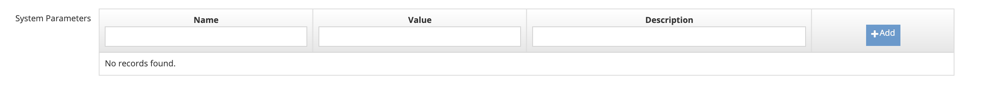

# Jenkins

**Testinium Enterprise Jenkins Plugin**

Set up plugin

Step **** 1: Upload plugin from hpi file.

.png>)

****

Step 2: Select Advanced tab

.png>)

Step 3: Upload plugin from hpi file

.png>)

Step 4: Check the installation

.png>)

Step 5: Add new Jenkins credentials for Testinium

.png>)

Step 6: Add new Jenkins credentials for Testinium

.png>)

Step 7: Add new Jenkins credentials for Testinium

.png>)

Step 8: Add testinium username and password

.png>)

Step 9: Check the credential

.png>)

Step 10: Go to Manage Jenkins > Configure System > Testinium Plugin

.png>)

Step 11: Select valid credentials.

.png>)

Step 12: Testinium Client ID: **Y2xpZW50MTpjbGllbnQx**

.png>)

Step **** 13: Add as Build Step

.png>)

Step 14: Select Project and Plan

Congrats you’ve set it up successfully!
