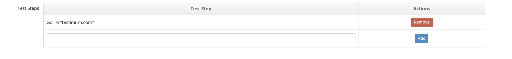

# Create New Scenarios

_**“Create New Scenarios”**_ directs the user to the screen where a new scenario definition is made in the system.

The following steps are followed to create a new scenario;

1. Select a project from the main Plans screen.

<figure><figcaption></figcaption></figure>

2. Click the _**Create New Scenario**_ button.

<figure><figcaption></figcaption></figure>

3. a. Enter the following fields on the Test Scenario Form screen;

* Project Name (selected from main Scenarios page)
* Scenario Name
* Description
* Expected Result
* Test Steps
* Group Name
* Repository URL (Whichever link will be used for the test code, that value is entered.)
* Source File (Which test code to run is selected here.)
* System Parameters (Whichever parameter will be added, those values should be entered.)
* Max Execution Time
* Enabled

<figure><figcaption>
Test Scenario Form 1
</figcaption></figure>

<figure><figcaption>
Test Scenario Form 3
</figcaption></figure>

b. Enter the test steps one by one in the _**Test Steps**_ field and click the Add button.

c. Enter the related values one by one in the _**System Parameters**_ field and click the Add button. Added values can be deleted and edited.

4. a. Click the _**Save**_ button to save the scenario.                                                                             b. Click the _**Cancel**_ button to cancel the scenario definition process.
