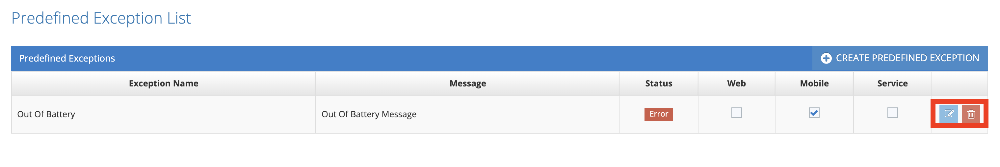

# Edit Predefined Exception

The following steps are followed on the Predefined Exception List page to edit exception;

1. Click the _**Edit**_ button.

<figure><figcaption></figcaption></figure>

2. Edit the following fields in the Predefined Exception Form page;

* Exception Name
* Message
* Exception Status
* Web, Mobile, Service selection

<figure><figcaption></figcaption></figure>

3.  a. Click the _**Save**_ button to save update.

    b. Click the _**Cancel**_ button to cancel the editing operation.
