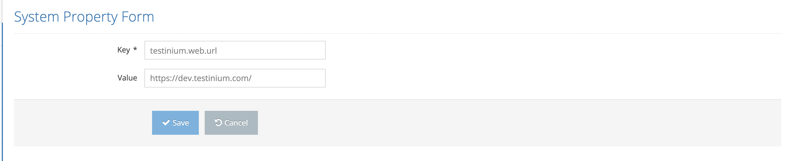

# Edit Property

The following steps are followed on the System Properties page to edit system properties;

1. Click the _**Edit**_ button.

<figure><figcaption></figcaption></figure>

2. Edit key and value field on the Licence Property Form if necessary.

<figure><figcaption></figcaption></figure>

3. a. Click the _**Save**_ button to save update.

&#x20;      b. Click the _**Cancel**_ button to cancel the editing operation.

