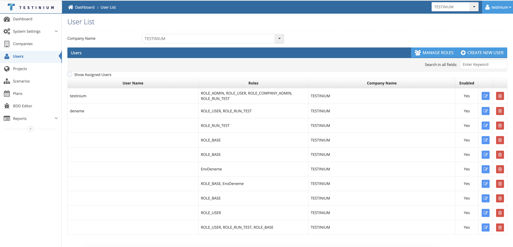

# Users

_**User**_ is the screen where the user definitions that will use the product on company basis in the system are made. Super Users in customers can be filtered by company name.

<figure><figcaption></figcaption></figure>
